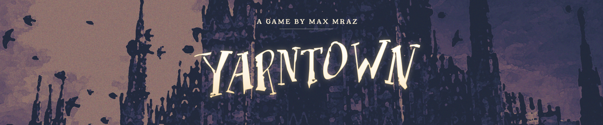
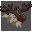
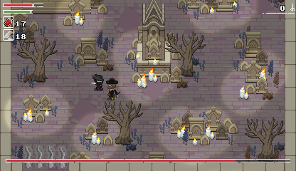
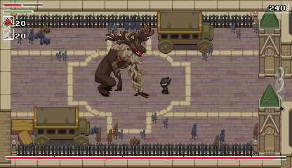

#  Yarntown

### Note: Yarntown has moved to gitlab!
https://gitlab.com/maxmraz/yarntown

- [About](#about)
- [License](#license)
- [Controls](#controls)
- [Gameplay](#gameplay)

## About

> *You've come on the night of the hunt. The streets of this cursed, gothic town are overrun with beasts, and what has become of the men who tried to hunt them before. Explore the twisting roads, go toe to toe with powerful foes, and uncover Yarntown's dark secrets.*

*Yarntown* is a **2D hommage to *Bloodborne***, a dark fantasy video game released on Playstation 4 in 2015. *Bloodborne* is as renowned for its demanding and merciless gameplay as for its incredible gothico-victorian atmosphere. This quest recreates only a part of the original game, because this is just a little side project.

*Yarntown* is available on **Windows**, **MacOS** and **Linux**, and powered by the [Solarus engine](https://www.solarus-games.org/).

 

## License

- Solarus engine is licensed as GPL v3.
- All code particular to this game is licensed the same.
- Graphic, music, and .dat assets are all rights reserved.
- This game is a tribute to the world of *Bloodborne*, but is unaffiliated with From Software.

## Controls

| Key      | Action |
|:--------:|--------|
| <kbd>←</kbd> <kbd>↑</kbd> <kbd>→</kbd> <kbd>↓</kbd> | Move. |
| <kbd>Space</kbd>                                    | Action / Dodgeroll. |
| <kbd>C</kbd>                                        | Swing weapon Hold to charge weapon attack. |
| <kbd>X</kbd>                                        | Shoot pistol. |
| <kbd>V</kbd>                                        | Use blood vial to heal. |
| <kbd>D</kbd>                                        | Pause and save. You will restart at the last lantern visited. |

## Gameplay

If you haven't played *Bloodborne*, here's a quick rundown of how it works. Be prepared to die often. You can't tell we didn't warn you.

### Combat

Using actions depletes your **stamina bar**. If it's all the way down, you won't be able to attack or dodge. The charged attack uses more stamina.

It is possible to **stun ennemies**. If you hit an enemy in the back with a charged attack, it will stun them. Using a normal attack while they're stunned will deal a large amount of damage. This is called a **Visceral Attack**.

You can also stun an enemy and open them up for a Visceral Attack if you shoot them just before they start attacking. The window for this varies by attack. The pistol doesn't do a ton of damage, so it is mainly useful for stunning an enemy like this.

You can **roll through enemies' attacks** if you time it properly: you're invincible for a few moments while rolling.

Enemies are very dangerous in groups, as they won't take turns to attack you. **Try to engage them one-on-one** whenever possible.

### Health

There are several lanterns throughout the level. You can choose to "Commune with the Dream" at them in order to **replenish your health**, and well automatically move Blood Vials and Bullets from storage to your inventory up to 20 each. However, resting at the lantern in this way will **bring any enemies you've defeated back to life**.

Defeating enemies gives you Blood Echoes. These are used as currency to buy items, as well as used to level up a Lanterns.

**When you die, you will restart at the last lantern you interacted with**. All your blood echoes, however, will remain where you died. Return there, without dying again, to retrieve them. If you die again without retrieving your blood echoes, they'll be lost forever.

### Stats

Choose to "Commune with the Dream" at a lantern to spend blood echoes to level up. You can raise several different stats:

- **Vitality** increases your health.
- **Endurance** increases your stamina.
- **Strength** increases the damage you do, as well as defense.
- **Skill** also increases the damage you do, the damage your pistol does, and the damage visceral attacks do.

You can find Bloodstone Shards which you can use at the table near the starting location to improve the damage your weapon does.

You can carry 20 Blood Vials and 20 Quicksilver Bullets on you at a time. If you collect more than this, they'll be sent to storage. When you die, or interact with a lantern, your vials and bullets will be moved from storage to your inventory, up to the limit of 20.
